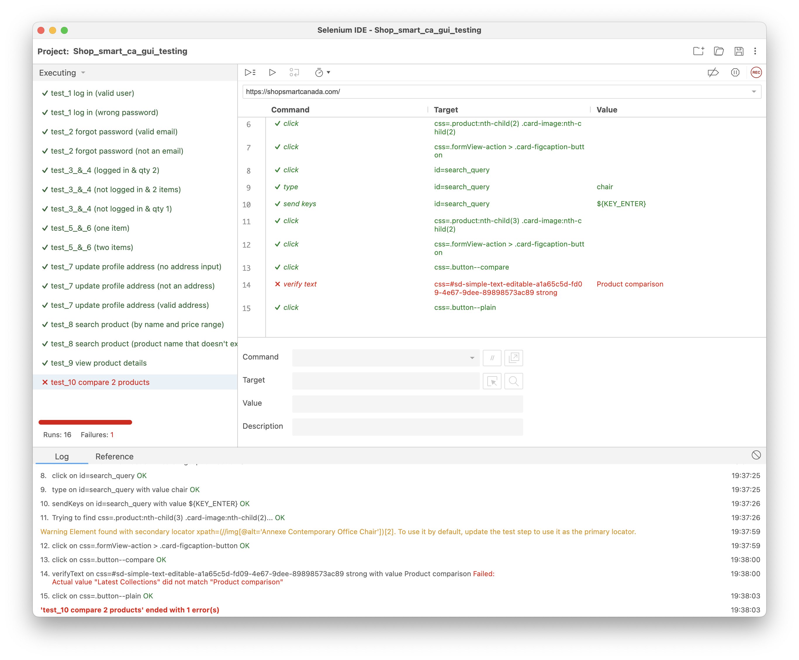

**SENG 637 - Dependability and Reliability of Software Systems**

**Lab. Report \#4 – Mutation Testing and Web app testing**

| Group \#:      | 21 |
|----------------|----|
| Student Names: |    |
| Carrie         |    |
| Jon            |    |
| Paolo          |    |
| Israel         |    |
| Henry          |    |

# Introduction

The purpose of this lab is to explore mutation tools and GUI Testing. In Part 1, we will explore the mutation results of
our previous Test cases developed for Range.java and DataUtilities.java from Assignment 2 & 3. This will be done using
the Pitest Eclipse Plugin that will generate mutations to run against the test suite, analyze the mutation results, and
improve upon the scores.

This lab provided some test files to practice using Pitest, the results for the provided RangeTest and DataUtilitiesTest
can be seen below for their target classes.

For part 2, we will use the web interface testing tool Selenium to become familiar with automated GUI testing on real
world websites. This includes Shop Smart Canada, Home Depot and Leon's. This will involve designing the test cases,
automating them in Selenium, verifying the output, and documenting the results after executing.

# Mutation Testing

## Analysis of 10 Mutants of the Range class

1. For if "(lower > upper)" of Range Constructor:

Mutation: Removed conditional - replaced comparison check with false → SURVIVED: This mutation changes the conditional
to if (false). This forces the condition to be false regardless of the values of upper and lower. Our Test suite does
not consider the contructor to check for invalid inputs thus this mutation survives. To kill this mutation, a test
specifically expecting an IllegalArgumentException for invalid input (lower > upper) would be required.

2. For "if (lower > upper)" of Range Constructor:

Mutation: Removed conditional - replaced comparison check with true → KILLED: This mutation changes the conditional to
if (true). This forces the condition to be true which ensures the Range constructor will always throw an
IllegalArgumentException. Our tests correctly handle and expect successful instantiation of Range objects with valid
inputs, causing them to fail without the objects.

3. For "return result" of constrain method:

Mutation: Incremented (a++) double local variable number 3 → SURVIVED: This mutation post increments result after it is
returned. This survives as the returned value remains unaffected by the mutation.

4. For "return result" of constrain method:

Mutation: Incremented (++a) double local variable number 3 → KILLED: In contrast to the previous, this mutation
pre-increments the result variable before it is returned. If result was a value within or exactly at the bounds of the
range, this mutation would alter it, making it incorrect. Tests like constrainValueWithinRange,
constrainLowerBoundValue, and constrainUpperBoundValue are potentially killing this mutation because they expect the
original value to be returned unchanged.

5. For "return result" of constrain method:

Mutation: replaced double return with 0.0d for org/jfree/data/Range::constrain → KILLED: This mutation changes the
method to always return 0.0, regardless of the actual value of result. The mutation was killed as our tests check the
output of constrain against various input values, ensuring it either returns the input value (if within range) or the
adjusted value (if outside the range).

6. For "return result" of constrain method:

Mutation: replaced return of double value with -(x + 1) for org/jfree/data/Range::constrain → KILLED: This mutation
replaces the returned value with a negated and incremented version of result (-(result + 1)). Our The tests expect
specific values based on the input and the range, so a return value of -(result + 1) would not match any expected
outcome killing this mutation.

7. For "return new Range(l, u);" in combine method:

Mutation: removed call to org/jfree/data/Range::<init> → KILLED: This mutation involves removing the call to the Range
class's constructor. Without the constructor call, the combine method fails to create and return a new Range object
representing the combination of range1 and range2. Various tests check the result of the combine method. If the method
fails to return a new Range object, these tests would fail and kill the mutant.

8. For "return new Range(l, u);" in combine method:

Mutation: Incremented (a++) Double Local Variable Number 2 → SURVIVED: This mutation post-increments the second local
variable, however similarly to the other post-incremented mutation, this is incremented after the variable is used in
the contructor, thus the Range object is unaffected allowing this mutation to survive.

9. For "return (value >= this.lower && value <= this.upper);" in contains method:

Mutation: Negated Double Field upper → KILLED: This mutation involves changing upper to -upper. This mutation was killed
by tests like containsValueWithinRange, containsValueOutsideRange, or containsValueAtUpperBound, which verify the
correct functioning of the upper boundary.

10. For "return (value >= this.lower && value <= this.upper);" in contains method:

Mutation: Negated Double Field lower → KILLED: Similar to the previous, this mutation involves changing lower to -lower.
This mutation was killed by the same tests mentioned above which verify the correct functioning of the lower boundary
and would fail by recieving the negated value.

## Report all the statistics and the mutation score for each test class

Results for Range and DataUtilities Before Improving Mutation Score:\
\
\

The goal will be to increase Mutation coverage by 10%, resulting in DataUtilities at 79% and Range at 47%. \
Note: Not all methods in the 2 classes had tests developed in previous Assignments. Already tested methods will be
focused on.

## Analysis drawn on the effectiveness of each of the test classes

In order to get a better representation of the mutation score, the configuration was changed such that any methods within the DataUtilities and Range class that were not tested were excluded from mutation. The results are as shown below:

In order to design new test cases to increase the mutation score, The “PIT Mutations” tab was studied after performing the initial mutation testing. Specifically, the “Survived” section, since this shows which mutations on which lines of code survived. 

Some of the test cases that were added killed mutants that removed a call to “nullNotPermitted” by calling methods that pass in null DefaultKeyedValues2D objects. This was done for calculateColumnTotal, calculateRowTotal, and getCumulativePercentages. Another test case was added to calculateColumnTotal, which uses column 1, killing a mutant that negates the value of the chosen column. In a previous test case, column 0 was used, which does not kill this mutant since -0 and 0 are effectively the same. In the Range class, a test case was added where the lower bound is greater than the upper bound, killing a mutant that replaces the check with “false”. Another test case was added to kill a mutant that replaces “==” with “<=” by using two ranges where the lower bound is the same but the upper bound is the same. 

## A discussion on the effect of equivalent mutants on mutation score accuracy

It was noted that there was a large number of equivalent mutants in the results. For example, there are a great number of post increment/decrement mutants. These mutants change values after they are returned, thus not changing the logic or output. There were also  mutants that substitute 1 with -1 in a boolean statement, which are syntactially the same since any value that is not zero is true. Another set of equivalent mutants involved specific for loops, replacing "less than" with "not equal to". These are equivalent mutants because since the iterating variable is initialized to zero, the variable will always stop at the given condition and it will never be greater than it, which makes "less than" and "not equal to" comparators behave the same.

## A discussion of what could have been done to improve the mutation score of the test suites

Since there are a great number of equivalent mutants, the mutation score of DataUtilities could only increase by 8%, but the Range class was able to increase by 12%. The mutation score of the test suite could be increased by configuring the mutation test to exclude certain types of mutations that would result in equivalent mutants. 

## Why do we need mutation testing? Advantages and disadvantages of mutation testing

Mutation testing plays a important role in identifying weaknesses in test cases and impoving test suite thoroughness.\
The advantages include 1. improving test suite robustness: If a test suite can detect mutated code, it suggests it is
able to better handle unexpected behaviour or changes to the original code. This consideration also improves test suite
design to expect and handle these potential cases. 2. Can provide insight to gaps or loopholes in specific test methods
that are not able to kill mutants. The mutations used can help uncover edge cases, or hidden bugs that may be overlooked
by more basic testing methods. This improves the overall code coverage for a more dependable application.

The disadvantages of mutation testing can include 1. The high computational cost of generating mutants (especially for
large projects) 2. Complexity in understanding and interpreting the results. It requires a bit of an exploratory process
to track how and why the mutation was killed or survived. This requires a more deeper understanding of the code and how
it's handling the changes. 3. Not all survived mutants are suggestive of weak tests. Equivalent mutants that do not
change the functionality of the code and will result in the false positives. This can lead to the need of manual review
to determine equivalence, which may be time consuming.

# GUI Testing

The test cases were designed for the Shop Smart Canada website. The interest of using Shop Smart Canada for this
assignment initially arose from the fact that Shop Smart was a website that none of the team members had heard of
before. Upon doing some exploration on the website and browsing for information, it was confirmed that the website is
not well-known. Additionally, Shop Smart Canada has a low trust score of 52/100 from Scamadviser. We also found a couple
of reviews from Trustpilot of costumer's complaining they ordered products just for the website to take their money and
later on notify them the item was out of stock. We did not find any positive reviews. This suggests that users perceive
Shop Smart Canada as a fraudulent or unreliable website to shop from. Or may indicate that the website interface and
functionality have defects. This made the website a good candidate for GUI testing and possibly finding defects when
compared to other well-known websites like Home Depot and Leon's.

## Explain your SELENIUM test case design process 

The design process was divided and organized into the following steps:

1. **Identification of functionalities**: This involved exploring the website to understand the layout, the different
   pages, and the functionalities available. This was done to identify the different test cases that could be automated
   using Selenium IDE.
2. **Identification of preconditions**: This involved identifying the preconditions that needed to be met before
   executing each test case. For example, to test the "Add to wish list" functionality, the user must be logged in.
3. **Identification of actions**: This involved identifying the different actions that would be performed on the
   website, such as clicking on buttons, entering data into input fields and submitting forms.
4. **Identification of input data**: This included both positive and negative test data that would be used to test the
   different functionalities of the website. The test
   data was identified based on the different input fields, check boxes and options available on the website.
5. **Identification of verification checkpoints**: This involved identifying the expected behaviour of the website when
   different
   actions are performed with the given input data to establish useful checkpoints for each test case.
6. **Identification of clean up actions**: This involved identifying the clean up actions that would be performed after
   each test case to ensure that the website is in the correct state for the next test case.

| No | Test Case                        | Pre-conditions                                   | Actions                                                                                                                                      | Input Data                                      | Automated Checkpoints                                                       | Clean up                |
|----|----------------------------------|--------------------------------------------------|----------------------------------------------------------------------------------------------------------------------------------------------|-------------------------------------------------|-------------------------------------------------------------------|-------------------------|
| 1  | Log in                           | None                                             | Navigate to login page, enter credentials, submit form                                                                                       | Email address, password                         | User redirected to profile/dashboard                              | Sign out                |
| 2  | Forgot password                  | None                                             | Navigate to login page, click forgot password, enter email, submit form                                                                      | Email address                                   | Confirmation message                                              | None                    |
| 3  | Add to cart                      | None                                             | Find product, click add to cart button                                                                                                       | Product selection                               | Product appears in cart, cart item count increases                | None                    |
| 4  | Remove from cart                 | Item must be present in the cart                 | Navigate to cart, click remove item button                                                                                                   | N/A                                             | Item removed from cart, cart item count decreases                 | None                    |
| 5  | Add item to wish list            | User must be logged in                           | Find product, click add to wish list button                                                                                                  | Product selection                               | Product appears in wish list                                      | Sign out                |
| 6  | Remove item from wish list       | User must be logged in and have item in wishlist | Click remove item on wishlist page                                                                                                           | N/A                                             | Item removed from wishlist                                        | Sign out                |
| 7  | Update profile address           | User must be logged in and have an address saved | Navigate to address in profile, update address information, submit form                                                                      | Address information (e.g. address, postal code) | Address updated successfully and displayed in profile             | Sign out                |
| 8  | Search product by name and price | None                                             | Enter search query, set min price and max price, submit search                                                                               | Search query, max price                         | Search results page displays products matching query              | None                    |
| 9  | View product details             | Positive product search results                  | Click on product, view product details                                                                                                       | Product selection                               | Product details page displays product features and specifications | None                    |
| 10 | Compare two products             | Positive product search results                  | Select one product, click compare button, repeat identical search query, select second product, click compare button, click compare products | Product selections                              | Comparison page appears and displays selected products                        | Clear compared products |

## Explain the use of assertions and checkpoints

The use of assertions in Selenium IDE is similar to the assert statement in Java with which we are familiar. Assertions
in Selenium are used to verify that the expected behavior of the website is consistent with the actual behavior. If an
assertion fails, the test case will fail, and the execution will be stopped. For example, if you're testing a login
feature, you would use an assertion to ensure the welcome message appears right after a user logs in. If that message
doesn't show up, the assertion fails, the test stops, and you know exactly where the failure occurred.

Assertions can be used to check if a specific element is present on the page, if the text of an element matches an
expected value, if the URL of the page is as expected, and so on. However, it is important to note that assertions are
most commonly used to verify critical functionality of the application. Assertions are invaluable in scenarios where
continuity without meeting certain criteria is meaningless or could lead to misleading test results. For example, if a
test involves validating a user's ability to navigate through a multi-step checkout process, an assertion could be used
at each step to ensure that proceeding to the next step is based on the correct completion of the current one.

Checkpoints are used in testing to verify specific points during the execution of the test case. In a similar fashion to
assertions, checkpoints can be used to check if a specific element is present on the page, if the text of an element
matches an expected value, if the URL of the page is as expected, etc. However, checkpoints will not stop the execution
of the test case if they fail. This approach allows for a broader evaluation of the application over the entirety of the
test scenario, offering insights into less critical, yet significant, aspects of the application's behavior.

For example, checkpoints can be strategically used to verify the loading time of a web page at different stages of a
test, helping identify performance issues that may not necessarily break the functionality but could degrade the user
experience. Similarly, in a complex application flow, checkpoints can verify intermediate states, such as the visibility
of certain UI elements or the accuracy of data displayed on the screen. This flexibility enables testers to accumulate a
comprehensive and more nuanced understanding of the application's performance and quality.

In conclusion, both assertions and checkpoints are essential for a robust testing strategy, but their application
depends on the specific goals of the test. Assertions are crucial for ensuring that the application does not proceed in
a state of error, functioning as guardrails. On the other hand, checkpoints are more forgiving and allow the test to
continue running and collecting data even when certain conditions are not met.

## How did you test each functionaity with different test data and automated verifcation points usage

- Log in: test data includes valid email address and password to verify correct login functionality. As well as
  providing invalid password to verify log in is not successful and error message is displayed.
- Forgot password: test data includes valid email address to verify a successful request confirmation message. As well
  as a not valid email address to verify an error message is displayed.
- Add to cart and remove from cart: test data includes user is not signed in, adding an item to the cart (verifying that
  the item was added), and emptying the cart
  (verifying that the cart is empty). As well as the user being signed in, adding a quantity of 2 of an item to the
  cart (verifying that the items were added),
  and removing an item (verifying that the selected item was removed and the other item remained).
- Add to wishlist and remove from wishlist: test data includes adding an item to the new wishlist, verifying that it is
  added, removing the item and verifying that
  the wishlist is empty. As well as adding two separate items to the wishlist, removing one item (ensuring that the
  selected item was removed) and verifying
  that the other item remains in the wishlist.
- Update profile address: test data includes inputting a valid address and an invalid address(address that does not
  exist) and verifying whether the address in profile
  updated. An empty input was also tested in the address field (this test data was used to verify that an error message
  would be displayed).
- Search product by name and price: test data includes searching for a product that should exist by name in the price
  range of 50 to 500, verifying that the search query returns matching results. As well as searching for a product with
  a name that does not exist and verify that no results are displayed.
  verifying that no results are displayed.
- View product details: includes selecting a product and verifying that the product page displays products details such
  as product features and specifications. There was only one type of test data, therefore only one test was necessary.
- Compare two products: includes selecting two products and verifying that the comparison page displays the selected
  products. This test case was not tested with any other test data since there was a defect (see Results and Defects Summary section
  for more details).

## Results and Defects Summary

Test cases from 1 to 9 were executed successfully with Selenium IDE. These test cases were designed to cover different
functionalities of the Shop Smart Canada website, such as logging in, adding items to the cart, adding items to the wish
list, updating profile address, searching for products by name and price, viewing product details, covering both
positive and negative scenarios to ensure that the website behaves as expected under different conditions and verifying
test cases by using both assertions and verification checkpoints.

Test case 10, which involves comparing two products, was not executed successfully because the Shop Smart Canada website
comparison feature is defective. The comparison feature allows to add products to the comparison list, but when trying to
compare the products, the website does not display the comparison page. This defect can be identified during test
execution.

Defects report:

| Test case Number | Test case Description | Defect Description | Actual Result | Expected Result | Severity | Steps to Reproduce |
|------------------|-----------------------|--------------------|---------------|-----------------|----------| ------------------- |
| 10               | Compare two products | Comparison feature is defective | Comparison page is not displayed | Comparison page should display selected products | High | Select one product, click compare button, repeat identical search query, select second product, click compare button, click compare products |

Additional Observations:

During the execution of our test suite (running all the test cases together), we encountered occasional instances where
test cases dependent on an active user session such as adding items to the cart or updating the profile address
unexpectedly failed. These failures were traced back to the Shop Smart Canada website unexpectedly logging the user out.

It's important to note that these failures were not consistent and could not be reliably reproduced. They appear to
arise from intermittent issues with the Shop Smart Canada website's session management, potentially on the backend
server. Given that these issues lie outside of the scope of the intented GUI testing of this assigment and do not
consistently affect the test outcomes, we decided not to include them in our main defects report. Additionally, we
confirmed that these session related failures did not occur when each test case was executed individually.

### Screenshot of test suite execution results:

# How the team work/effort was divided and managed

For part 1, mutation testing, the team divided the mutation analysis evenly.
Carrie: analysed mutants 1 and 2, focusing on conditional checks within the Range constructor.
Jon: analysed mutants 3 and 4, both concerning the constrain method.
Paolo: analysed mutants 5 and 6, which involve changes to the return values of the constrain method.
Israel: analysed mutants 7 and 8, focusing on the combine method.
Henry: covered mutants 9 and 10, dealing with the contains method.

For part 2, GUI testing with Selenium. Each member designed and automated 2 test cases for
different functionalities of the Shop Smart Canada website. The distribution was as follows:
Carrie: designed and automated test cases for "Log in" and "Forgot password" functionalities.
Jon: took responsibility for the "Add to cart" and "Remove from cart" functionalities.
Paolo: focused on the "Add item to wish list" functionality and "Remove item from wish list".
Israel: developed test cases for "Update profile address" and "Search product by name and price".
Henry: concentrated on automating "View product details" and "Compare two products" process.

The lab report was completed collaboratively and everyone contributed freely to any sections we wished to work on. We
performed peer review upon each other's work.

# Difficulties encountered, challenges overcome, and lessons learned

One of the most significant difficulties during GUI testing with Selenium IDE was the intermittend issue of some log in
dependent test cases failing due to unexpected session log out. This observation underscores the complexity of web-based
testing and highlights the importance of considering external factors that may influence the reliability of automated
test results. The lesson learnt from this, is that any software project requires a comprehensive testing strategy that
takes into account several factors, approaches and available tools.

Another significant challenge during mutation testing analysis and trying to create new test cases to improve the
quality of the test suite was dealing with equivalent mutants, which we found very time consuming. Even though the
mutants can be generated automatically, mutation testing still requires human skill and an understanding of the system
under test. The lesson learned is that a good test suite not only captures obvious bugs but also requires an
understanding of the code's logic.

# Comments/feedback on the assignment itself

Overall this assigment was a good exposure to Mutant testing and Selenium IDE. We found mutant testing to be a little
bit harder to understand than the previous approaches we implemented so far. And we liked the hands-on approach of 
Selenium IDE as an introduction to the selenium ecosystem.
